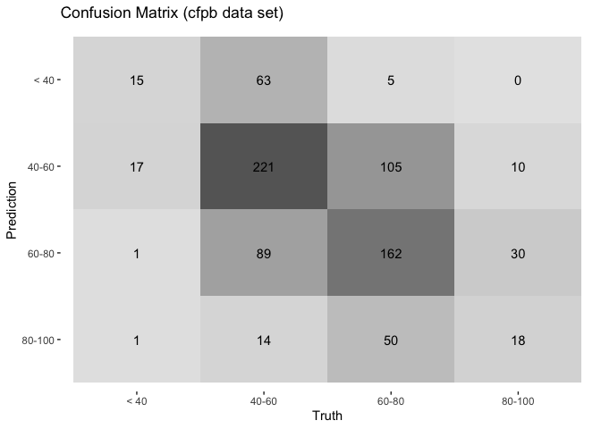
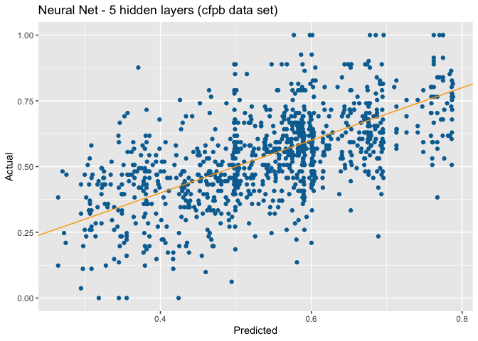
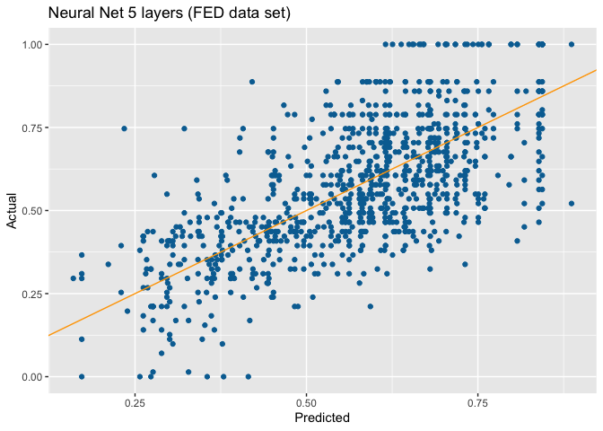

```{r setup, include=FALSE}
knitr::opts_chunk$set(echo = TRUE)

library(utils)

library(tidyverse)
library(tidymodels)
library(textrecipes)
library(discrim)
library(dplyr)
library(plyr)
library(naivebayes)

library(glue)
library(GGally)
library(kableExtra)
library(vip)

```


# Overview

Financial wellness can be defined in different ways for the purposes of this analysis Financial wellness will be defined as an individuals relationship with money. This definition refers to how secure your money is, given all the variables involving an unknown future. [*Financial Education Council*](https://www.financialeducatorscouncil.org/financial-wellness-definition/). 


This is a broad definition but it includes several key concepts such as: 
- Preparation for emergencies
- Active short term and long term plans and goals
- Budgeting and attitudes towards money
- Feelings towards your finances


Intuitively we understand the importance of financial wellness to an individuals immediate financial stability, their long-term aggregation of wealth and financial sustainability in retirement. These benefits are well documented, studied and highlighted by financial advisers and wealth management firms. However the impact of financial wellness on your emotional and mental health should not be ignored our understated. The stress, anxiety, depression, sleep deprivation or even lack of motivation that comes with poorly handled money matters will impact all aspects of your life. 


| *When people are in control of their money, they’re in control of their lives. They’re happier, less anxious and more empowered.* [*nudge*](https://www.nudge-global.com) 

Few topics will have such a large impact on an individuals current and future life from both an economic and a mental health perspective. Key to developing financial wellness in the general population is understanding how to measure it and what factor impact it. The goal of this project is to explore the measurements of financial wellness and the factors that determine it. I have been interested in measures and predictors of financial wellness for several years. 

For this project I have identified two data sets that share a common measure of financial wellbeing. The Consumer Financial Protection Bureau has developed a measurements of financial wellbeing called the Financial Wellbeing Scale. The Federal Reserve System utilizes this same measurement for financial wellbeing in their annual household decision maker survey.


## Data Sources:

There are numerous studies of financial wellness sponsored by financial firms, industry groups and government agencies. I choose to focus on two studies:

- Consumer Financial Protection Bureau - Financial Wellness Survey [*Financial well-being data*](https://www.consumerfinance.gov/data-research/financial-well-being-survey-data/) The PUF survey results can be accessed as a csv file [*Financial well-being survey data*](https://www.consumerfinance.gov/documents/5614/NFWBS_PUF_2016_data.csv)

- Federal Reserve System - Survey of Household Economic and Decision making  [*Federal Reserve Household Economic Decisions*](https://www.federalreserve.gov/consumerscommunities/shed_data.htm) The SHED survey results can be accessed as a zip file [*Survey of Household Economics and Decisionmaking 2020*](https://www.federalreserve.gov/consumerscommunities/files/SHED_public_use_data_2020_(CSV).zip)


These are comprehensive studies that are conducted periodically using similar methodology. Both studies survey the population to gather demographic, financial and behavioral data from individuals. Both studies include the same measure of financial wellbeing that was defined and operationalized by the Consumer Financial Protection Bureau called the Financial Well-Being Scale. The Financial Well-Being Scale was created as part of the Consumer Financial Protection Bureau to encourage Financial Wellness.

<br><br>
The score is calculated using 10 questions survey:

**How well does this statement describe you or your situation?**

1. I could handle a major unexpected expense
2. I am securing my financial future
3. Because of my money situation, I feel like I will never have the things I want in life*
4. I can enjoy life because of the way I’m managing my money
5. I am just getting by financially
6. I am concerned that the money I have or will save won’t last

<br>
**How often does this statement apply to you?**

7. Giving a gift for a wedding, birthday or other occasion would put a strain on my finances for the month*
8. I have money left over at the end of the month
9. I am behind with my finances
10. My finances control my life


### Consumer Financial Protection Bureau - Financial Wellness Survey

The data was collected as part of the Consumer Financial Protection Bureau’s (CFPB) National Financial Well-Being Survey Public Use File (PUF). The PUF is a data set containing:

1. demographic data
2. assessment of financial knowledge
3. financial positions 
4. financial products owned
5. financial well-being scale


The National Financial Wellbeing Survey was conducted in English and Spanish digitally / online between October 27, 2016 and December 5, 2016. Overall, 6,394 surveys were completed: 5,395 from the general population sample and 999 from an oversample of adults aged 62 and older. The survey was designed to represent the adult population of the 50 U.S. states and the District of Columbia. The survey was fielded on the GfK KnowledgePanel®. The KnowledgePanel sample is recruited using address-based sampling and dual-frame landline and cell phone random digit dialing methods.

The PUF was published in 2017.


### Federal Reserve System - Survey of Household Economic and Decision making (SHED)

The data was collected as part of the Report on the Economic Well‐Being of U.S. Households in 2020,and examines the economic well-being and financial lives of U.S. adults and their families.


The SHED includes:

1. demographic data
2. assessment of financial knowledge
3. financial products owned
4. financial positions 
5. economic fragility
6. financial well-being scale


The SHED is sponsored by the Board of Governors of the Federal Reserve System. The surveys that generate the data is collected by Ipsos using their online probability based KnowledgePanel.  The 2020 survey of more than 11,000 adults was conducted in November 2020, offering a picture of how people were faring eight months after the onset of the COVID-19 pandemic.

The SHED was published in 2020.


## Setup

```{r clean, results="hide"}

set.seed(1234)
rm(list=ls())

```


```{r external_functions, results="hide",  error=TRUE}
# Exported data load, tidy function and tibble cleaning
fun_file_name <- glue(getwd(), "/ProjectFinal/DATA607_Functions.R")
source(fun_file_name, local = knitr::knit_global())

```


## Workflow

This project is based on the OSEMN analysis Model. The OSEMN model is defined by the following steps:

- Obtain - Source a sufficient corpus of usable data to conduct the desired analysis 
- Scrub - Preparing the data for further analysis by restructuring, cleaning, and filtering the data set
- Explore - Conduct an initial exploration of the data to better understand the cases and the variables
- Model - Fit the model to the data once it has been cleaned, explored and properly formatted
- iNterpret - Explore the output of the model to understand the accuracy


{width=100%}


# Obtain

The data for the analysis was obtained from the following sources:

- Consumer Financial Protection Bureau - Financial Wellness Survey: The PUF survey results can be accessed as a csv file [*Financial well-being survey data*](https://www.consumerfinance.gov/documents/5614/NFWBS_PUF_2016_data.csv)

- Federal Reserve System - Survey of Household Economic and Decision making: The SHED survey results can be accesssed as a zip file [*Survey of Household Economics and Decisionmaking 2020*](https://www.federalreserve.gov/consumerscommunities/files/SHED_public_use_data_2020_(CSV).zip)

```{r obtain}

# load raw data
cfpbRaw_df <- getRawCFPBFile()
fedRaw_df <- getRawFedFile()


# calculate sample stats for each survey
s_df <- tibble("name"=character(), "vars"=double(), "obs"=double(), "cfpb_mean"=double(),
               "cfpb_median"=double(), "cfpb_std"=double() )
s_df <- s_df %>% add_row(name="cfpb", vars=ncol(cfpbRaw_df) ,obs=nrow(cfpbRaw_df),
                        cfpb_mean=round(mean(cfpbRaw_df$FWBscore),2), 
                        cfpb_median=round(median(cfpbRaw_df$FWBscore),2), 
                        cfpb_std=round(sd(cfpbRaw_df$FWBscore),2))
s_df <- s_df %>% add_row(name="fed", vars=ncol(fedRaw_df) ,obs=nrow(fedRaw_df),
                        cfpb_mean=round(mean(fedRaw_df$CFPB_score),2), 
                        cfpb_median=round(median(fedRaw_df$CFPB_score),2), 
                        cfpb_std=round(sd(fedRaw_df$CFPB_score),2) )

s_df %>%
  kbl() %>%
  column_spec(1, bold = T, border_right = T) %>%
  kable_paper(bootstrap_options = "striped", fixed_thead = T,full_width = F)


```


```{r}
# cfpb
ggplot(cfpbRaw_df,
    aes(FWBscore, y = stat(density))) +
    geom_histogram(binwidth = 1, alpha = 0.7, bins = 100, color="white",size = 0.1) +
    geom_vline(aes(xintercept = mean(FWBscore)), linetype = "dashed", color="red", size = 0.5) +
    scale_fill_brewer(palette="Spectral") +
    labs(title = "CFPB Score (cfpb dataset)")

summary(cfpbRaw_df$FWBscore)
```

```{r}
# fed
ggplot(fedRaw_df,
    aes(CFPB_score, y = stat(density))) +
    geom_histogram(binwidth = 1, alpha = 0.7, bins = 100, color="white",size = 0.1) +
    geom_vline(aes(xintercept = mean(CFPB_score)), linetype = "dashed", color="red", size = 0.5) +
    scale_fill_brewer(palette="Spectral") +
    labs(title = "CFPB Score (federal reserve data set)")

summary(fedRaw_df$CFPB_score)
```

The cfpb scores from the Federal Consumer Protection Bureau and the Federal Reserve System appear to follow a normal distribution with similar sample statistics for mean median and standard deviation. 


**observations**

- The Financial Wellbeing Scaled score has consistent stats across both surveys
- The Survey's are comprehensive and will require filtering and variable selection to create a manageable data set of cases and variables.
- Most of the variables are categorical
- The CFPB survey data is coded based on the survey responses. To be usable the data can be converted to factor variables that capture the survey code and the definition
- The survey response data requires the associated code books to decipher the variables in the file.


# Scrub

The scrub step in the process leverages the two code books for the survey to filter, translate and rename the variables.

- Variable Selection - To identifying a subset of the variable to use in the analysis I relied on existing theory, survey findings and variables that I was interested in exploring. Additional / different variables could be used in subsequent analysis to explore other theories. 
- Transforming - To transform the survey data I relied on the code books for each surveys to better understand the attribute and response coding. The Fed survey results included full text answer in a non UTF-8 format. The data was transformed to a UTF-8 format and truncated for readability.
- Filtering - To reduce the compute time and make the analysis manageable I took a random subset of the data ensuring that preserved the breakdown of cfpb score categories from the full data set.
- Outliers - there are a small number of records with a negative fin well scale score. Given the methodology for calculating the score these observations are anomalies and were deleted from the data set. 


```{r}

# get cfpb file
cfpb_df <- getCFPBFile()
cfpb_df$cfpb_score_4cat <- cut(cfpb_df$cfpb_score, breaks = c(-10, 40, 60, 80, 100),
                           labels = c("< 40","40-60","60-80","80-100"),
                           right = FALSE,
                           include.lowest=TRUE) 
s_df <- tibble("cfpb" = levels(count(cfpb_df$cfpb_score_4cat)$x))
s_df <- add_column(s_df,"cfpb_freq" = count(cfpb_df$cfpb_score_4cat)$freq)
cfpb_df <- cfpb_df %>% filter(cfpb_score >= 0)

# reduce cfpb dataset
cfpb_df <- slice_sample(cfpb_df, weight_by=cfpb_score_4cat ,n=4000) 
s_df <- add_column(s_df,"cfpb_filter" = levels(count(cfpb_df$cfpb_score_4cat)$x))
s_df <- add_column(s_df,"cfpb_filter_freq" = count(cfpb_df$cfpb_score_4cat)$freq)


# get fed file
fed_df <- getFedFile()
fed_df$cfpb_score_4cat <- cut(fed_df$cfpb_score, breaks = c(-10, 40, 60, 80, 100),
                           labels = c("< 40","40-60","60-80","80-100"),
                           right = FALSE,
                           include.lowest=TRUE) 
s_df <- add_column(s_df,"fed" = levels(count(fed_df$cfpb_score_4cat)$x))
s_df <- add_column(s_df,"fed_freq" = count(fed_df$cfpb_score_4cat)$freq)

# reduce cfpb dataset
fed_df <- slice_sample(fed_df, weight_by=cfpb_score_4cat ,n=4000) 
s_df <- add_column(s_df,"fed_filter" = levels(count(fed_df$cfpb_score_4cat)$x))
s_df <- add_column(s_df,"fed_filter_freq" = count(fed_df$cfpb_score_4cat)$freq)


```

The survey results were sampled using a consistent weight for cfpb score. The resulting dataset includes 4000 surveys from each survey data set. 

```{r}

s_df   %>% kbl() %>%
  kable_paper(bootstrap_options = "striped", fixed_thead = T,full_width = F)

dim(cfpb_df)
dim(fed_df)

```


```{r}

# cfpb
ggplot(cfpb_df,
    aes(cfpb_score, y = stat(density))) +
    geom_histogram(binwidth = 1, alpha = 0.7, bins = 100, color="white",size = 0.1) +
    geom_vline(aes(xintercept = mean(cfpb_score)), linetype = "dashed", color="red", size = 0.5) +
    scale_fill_brewer(palette="Spectral") +
    labs(title = "CFPB Score (cfpb dataset)")
summary(cfpb_df$cfpb_score)

```


```{r}


# fed
ggplot(fed_df,
    aes(cfpb_score, y = stat(density))) +
    geom_histogram(binwidth = 1, alpha = 0.7, bins = 100, color="white",size = 0.1) +
    geom_vline(aes(xintercept = mean(cfpb_score)), linetype = "dashed", color="red", size = 0.5) +
    scale_fill_brewer(palette="Spectral") +
    labs(title = "CFPB Score (federal reserve data set)")

summary(fed_df$cfpb_score)


```


<br><br>
**observations**

- Sampling - the sampling of the two survey data sets did not impact the distribution of the cfpb score in either data set. 
- Outliers - the data includes outlier score below 20 and above 90. Since this distribution is likely a reflection of the population these records were retained in the data set.


# Explore

The survey data is comprehensive with 217 variables in the CFPB Survey and 372 variables in the Federal Reserve survey. To reduce the solution space the survey data was pre-filtered to only include variables that I thought would be likely to contribute to the effectiveness of the model. A subset of the variable exploration is included in this document additional visualization and analysis can be found in the accompanied DATA607_Plot document and the DATA607_STEP document. 

<br>
**Consumer Financial Protection Bureau - Survey**

- econ_save_rate (SAVINGSRANGES) - How much money do you have in savings today...?
- house_mortgage (MORTGAGE) - What do you owe on your home today?
- age_8cat (agecat) - Age in 8 categories
- econ_hh_income (PPINCIMP) - Household Income

<br>
**Federal Reserve System - Survey**

- age_7cat (ppagecat) - Age in 7 Categories
- econ_saving (ppfs0596) - Q22: What is the approximate total amount of your household's savings and invest
- econ_inc_4cat (inc_4cat_50k) - Income (I40) ‐ 4 cat ‐ <25,25‐49,50‐99,100+
- econ_fin_ok (atleast_okay) - Doing okay financially
- econ_pay_exp400 (pay_casheqv) - Would handle $400 expense with cash or equivalent
- econ_skip_med (skip_medical) - Went without medical care


## Consumer Financial Protection Bureau

From the initial exploration of the dependent variable, Financial Well-Being Scale (cfpb_score) follows the normal distribution with a cluster of results on the high and low end of scale. The median and the mean are similar and the the distribution appears to be symmetric. The structure of the distribution suggest that there might be an opportunity to explore the top range of the distribution and the lower end of the distribution separately. This seems consistent with how the poor and the wealthy experience and navigate the economy.

Each of the survey questions includes the option not to provide answer. This creates incomplete data sets for a small proportion of the survey responses. The records for these incomplete cases where not filtered out until the specific model required complete records. 


```{r}

cfpb_tmp_df <- cfpb_df %>% select(cfpb_score, econ_hh_income, econ_save_rate, age_8cat)
summary(cfpb_tmp_df)

```


**Observations**

- Low correlation across numeric values - There are limited numeric values in the survey data. The numeric data that exists is not heavily correlated. This is somewhat surprising given that at least 4 of the numeric values are defined to reflect financial knowledge or financial wellbeing. The only two variable that display a correlation above 0.5 are the cfpb score for scaled financial wellness (FWBscore) and the Lusardi and Mitchell financial knowledge Summative scale scale scorescore (LMscore).

- Correlation varies by education and income level - Even though the overall correlation between numeric variables is low there is a difference in correlation across education levels and income groups. Segmenting the population using these variables is an avenue for further analysis. 


```{r}

ggscatmat(data=cfpb_df, corMethod = "spearman", alpha=0.2)
ggscatmat(data=cfpb_df, color="edu_level", corMethod = "spearman", alpha=0.2)
ggscatmat(data=cfpb_df, color="econ_hh_income", corMethod = "spearman", alpha=0.2)


```


**explore specific variables**

The top categories for house values, morgage and income start at \$150,000, \$200,000 and \$150,000. The lowest categories for house value, mortgage and income include \$150,000, \$50,000 and \$20,000. The lowest categories and highest categories for these variables likely exhibit different behavior and economic engagement. 


```{r}

# econ_hh_income 
ggplot(cfpb_df, aes(x=econ_hh_income)) +
  geom_bar(color="white", fill="black", alpha = 0.6, size = 0.1) +
  coord_flip() +
  labs(title = "econ_hh_income")

ggplot(data = cfpb_df) +
  geom_boxplot(mapping = aes(x=cfpb_score, y=econ_hh_income, color=econ_hh_income)) +
  labs (title = "econ_hh_income")


ggplot(cfpb_df,
    aes(cfpb_score, fill = econ_hh_income, y = stat(density))) +
    geom_histogram(binwidth = 1, alpha = 0.7, bins = 100, color="white",size = 0.1) +
    geom_vline(aes(xintercept = mean(cfpb_score)), linetype = "dashed", size = 0.2) +
    scale_fill_brewer(palette="Spectral") +
    labs(title = "CFPB Score (by econ_hh_income)")

```


The initial review of the comparative visualizations for race and cfpb score seem to indicate that race may not be a primary driver of financial wellbeing. There is some correlation between race and wellness score but the strength of that relationship is not directly evident in the following graphs.  

```{r}
# race
ggplot(cfpb_df, aes(x=race)) +
  geom_bar(color="white", fill="black", alpha = 0.6, size = 0.1) +
  coord_flip() +
  labs(title = "race")

ggplot(data = cfpb_df) +
  geom_boxplot(mapping = aes(x=cfpb_score, y=race, color=race)) +
  labs (title = "race")

ggplot(cfpb_df,
    aes(cfpb_score, fill = race, y = stat(density))) +
    geom_histogram(binwidth = 1, alpha = 0.7, bins = 100, color="white",size = 0.1) +
    geom_vline(aes(xintercept = mean(cfpb_score)), linetype = "dashed", size = 0.2) +
    scale_fill_brewer(palette="Spectral") +
    labs(title = "CFPB Score (by race)")
```


The distribution of responses for the house mortgage survey question seem to reflect an unwillingness by survey respondents to share these details with the pollster. Just over 1700 survey respondents declined to answer the question. 

```{r}
# house_mortgage
ggplot(cfpb_df, aes(x=house_mortgage)) +
  geom_bar(color="white", fill="black", alpha = 0.6, size = 0.1) +
  coord_flip() +
  labs(title = "house_mortgage")

ggplot(data = cfpb_df) +
  geom_boxplot(mapping = aes(x=cfpb_score, y=house_mortgage, color=house_mortgage)) +
  labs (title = "house_mortgage")

ggplot(cfpb_df,
    aes(cfpb_score, fill = house_mortgage, y = stat(density))) +
    geom_histogram(binwidth = 1, alpha = 0.7, bins = 100, color="white",size = 0.1) +
    geom_vline(aes(xintercept = mean(cfpb_score)), linetype = "dashed", size = 0.2) +
    scale_fill_brewer(palette="Spectral") +
    labs(title = "CFPB Score (by house_mortgage)")

count(cfpb_df$house_mortgage)

```


## Federal Reserve System

The data set from the Federal Reserve survey includes several questions that produce variable with overlapping measures. This includes the variables that measure education level, employment, house hold composition and economic circumstances. As part of the modeling selection process we will look to rationalize the list of variables so that we do not include several variables that measure the same underlying characteristic. Similar to the survey data from the CFPB a portion of the respondent declined to answer specific questions. We will filter out incomplete cases as required by the model being used. 


**Observations**

- Few numeric variables with limited correlations. - similar to the CFPB survey data the Federal Reserve survey data reflects low correlation between the numeric variables in the data set. It should also be noted that the FED data set includes very few unique numeric variable. The overwhelming proportion of survey questions are designed around answer that can be placed in categories. The numeric numbers that exist primarily focus on house hold composition. 
- survey data includes non complete records - the second phase of the analysis would be to identify smaller subset of the variable and review the impact of incomplete data sets and outliers.  


```{r}

#fed_tmp_df <- fed_df %>% select(cfpb_score, econ_saving, econ_fin_ok, econ_pay_exp400, econ_skip_med, edu, credit_guess)
fed_tmp_df <- fed_df %>% select(cfpb_score, age_7cat, econ_saving, econ_inc_4cat, econ_fin_ok, econ_pay_exp400, econ_skip_med) #0.4675

summary(fed_tmp_df)

```


The highest correlation in the numeric data is for children age 13 - 17 and over 18 years. These variables have a high correlations with cfpb score but they do not contributes substantially to the model .

```{r}

ggscatmat(data=fed_df, corMethod = "spearman", alpha=0.2)
ggscatmat(data=fed_df, color="race", corMethod = "spearman", alpha=0.2)
ggscatmat(data=fed_df, color="gender", corMethod = "spearman", alpha=0.2)
ggscatmat(data=fed_df, color="age_7cat", corMethod = "spearman", alpha=0.2)

```


**explore specific variables**

The Economic circumstance variables (econ_fin_ok, econ_pay_exp400, econ_skip_med) are heavily represented in the federal reserve model. This is not surprising given the nature of the questions that define the cfpb score. It indicate the survey respondents are aware of their current financial wellness circumstance.  As you can see from the grouped histogram there is distinct shift in the distribution upwards for survey respondents who feel they are on firmer footing financial. The alignment of the decision to forgo medical care based on on cfpb score highlights some real world impacts financial wellness. Finally it should be noted that there are cluster of outlier data at the high end and lower end of the distribution. 
 


```{r}
# econ_fin_ok
ggplot(fed_df, aes(x=econ_fin_ok)) +
  geom_bar(color="white", fill="black", alpha = 0.6, size = 0.1) +
  coord_flip() +
  labs(title = "econ_fin_ok")

ggplot(data = fed_df) +
  geom_boxplot(mapping = aes(x=cfpb_score, y=econ_fin_ok, color=econ_fin_ok)) +
  labs (title = "econ_fin_ok")

ggplot(fed_df,
    aes(cfpb_score, fill = econ_fin_ok, y = stat(density))) +
    geom_histogram(binwidth = 1, alpha = 0.7, bins = 100, color="white",size = 0.1) +
    geom_vline(aes(xintercept = mean(cfpb_score)), linetype = "dashed", size = 0.2) +
    scale_fill_brewer(palette="Spectral") +
    labs(title = "CFPB Score (by econ_fin_ok)")

```


```{r}

# econ_skip_med
ggplot(fed_df, aes(x=econ_skip_med)) +
  geom_bar(color="white", fill="black", alpha = 0.6, size = 0.1) +
  coord_flip() +
  labs(title = "econ_skip_med")

ggplot(fed_df) +
  geom_boxplot(mapping = aes(x=cfpb_score, y=econ_skip_med, color=econ_skip_med)) +
  labs (title = "econ_skip_med")

ggplot(fed_df,
    aes(cfpb_score, fill = econ_skip_med, y = stat(density))) +
    geom_histogram(binwidth = 1, alpha = 0.7, bins = 100, color="white",size = 0.1) +
    geom_vline(aes(xintercept = mean(cfpb_score)), linetype = "dashed", size = 0.2) +
    scale_fill_brewer(palette="Spectral") +
    labs(title = "CFPB Score (by econ_skip_med)")

```


```{r}

# econ_pay_exp400
ggplot(fed_df, aes(x=econ_pay_exp400)) +
  geom_bar(color="white", fill="black", alpha = 0.6, size = 0.1) +
  coord_flip() +
  labs(title = "econ_pay_exp400")

ggplot(data = fed_df) +
  geom_boxplot(mapping = aes(x=cfpb_score, y=econ_pay_exp400, color=econ_pay_exp400)) +
  labs (title = "econ_pay_exp400")

ggplot(fed_df,
    aes(cfpb_score, fill = econ_pay_exp400, y = stat(density))) +
    geom_histogram(binwidth = 1, alpha = 0.7, bins = 100, color="white",size = 0.1) +
    geom_vline(aes(xintercept = mean(cfpb_score)), linetype = "dashed", size = 0.2) +
    scale_fill_brewer(palette="Spectral") +
    labs(title = "CFPB Score (by econ_pay_exp400)")

```


# Model

This analysis will focus on a linear regression model as the foundation of the conclusions. However one of the goals for this project was to explore different data science models. To these ends we will touch on a random forest model and neural network model that will utilize the same data set to generate a predictive model. 

<br>
**The analysis includes the following models:**

- linear regression model using parsnip packages from tidy models
- random forest model using parsnip packages from tidy models
- neural network model using the neuralnet package

<br>
**Preconditions for Linear Models**

The residual analysis from the CFPB model and Federal Reserve model roughly adheres to the following pre-conditions for linear modeling. More analysis would be required to ensure independence and a linear relationship to the dependent variable. It would be difficult to assert full independence of the predictor variables given that each case reflect an individual. Thre are numerouse studies that link demographics, race, geography and age to economic outcomes. 

1. residuals are nearly normal
2. residuals have constant variability
3. residuals are independent
4. each variable is linearly related to the outcome


**Model Definition and Variable Selection**

The analysis started with a review of the survey code book to identify candidate variables for the analysis. Then relying on the findngs from each survey, and industry knowledge I conducted an initial variable selection. This selection process was used as a starting point, additional analysis could be conducted to refine the initial lists. 


24 variables from the CFPB Survey. 
- house hold structure
- housing economics and ownership characteristics
- income
- demographic
- geographic
- measures of financial knowledge and financial wellness


43 variable from the Fed Survey file were selected.
- house hold structure
- housing economics and ownership characteristics
- income
- demographic
- geographic
- measures of financial knowledge and financial wellness
- assessment of econmic situation


As an extension of the variable exploration stepwise regression was used to optimize the model variables based on their contribution to the model accuracy. I started using manual stepwise variable elimination process but opted for automated approach to simplify the analysis. The two approaches converged on models with similar accuracy and complexity but included different variables. 

I used three automated model selection methods from the tidyverse packages for stepwise regression, Akaike information criterion(AIC) and Bayesian information criterion(BIC). The three methods of stepwise regression generated several candidates for the final model. I selected 2 models that although did not have the highest r-squared seemed to provide a good balance between accuracy and simplicity. 


## Consumer Financial Protection Bureau 

The final model for the CFPB survey data included
- econ_save_rate
- house_mortgage
- age_8cat
- econ_hh_income

The model selected was generated by Bayes information criteria (BIC) algorithm, it had an r-squard of 0.4167 based on the 4 variables above. The alternative model had an r-squared of 0.4248 based on 8 variables. It should be noted that although I used the same seed in both files the resulting r-squared is slightly different for the parsnip linear regression model. 


```{r}

# select independent variables
cfpb_df <- cfpb_df %>% select(cfpb_score, econ_save_rate, house_mortgage, age_8cat, econ_hh_income)


# split data
cfpb_split <- initial_split(cfpb_df, prop = 0.8, strata = cfpb_score)
cfpb_training <-  training(cfpb_split)
cfpb_test <-  testing(cfpb_split)

```


Model stats
- r-squared for the model is 0.4118
- The residual analysis analysis shows several outliers that are impacting the model


```{r}

# Model Specification
lm_model <- linear_reg() %>% 
            set_engine('lm') %>% 
            set_mode('regression')


# Fitting to Trained Data
lm_fit <- lm_model %>% 
          fit(cfpb_score ~ ., data = cfpb_training)


# Explore Training Results
names(lm_fit)
summary(lm_fit$fit)
par(mfrow=c(2,2)) 
plot(lm_fit$fit, pch = 16, col = '#006EA1')


# Data frame of estimated coefficients
tidy(lm_fit)

# Performance metrics on training data
glance(lm_fit)  

# variable importance
vip(lm_fit, num_features=25)

```


```{r}

#predict(lm_fit, new_data = cfpb_test)

cfpb_results <- predict(lm_fit, new_data = cfpb_test) %>% 
                            bind_cols(cfpb_test)

#cfpb_results

# RMSE on test set
rmse(cfpb_results, truth = cfpb_score, estimate = .pred)
rsq(cfpb_results, truth = cfpb_score, estimate = .pred)


```


```{r}

ggplot(data = cfpb_results,
       mapping = aes(x = .pred, y = cfpb_score)) +
  geom_point(color = '#006EA1') +
  geom_smooth(method = lm) +
  geom_abline(intercept = 0, slope = 1, color = 'orange') +
  labs(title = 'Linear Regression Results - CFPB Score',
       x = 'Predicted',
       y = 'Actual')

```


### Machine Learning Model (Random Forest)

Additional analysis was conduct by creating a random forest machine learning model using parsnip from the tidy models package. The model was based on the varaiables selected in the previous linear regression model. The full model is available in the DATA607_ML.Rmd file. The resulting model is a categorical model with 4 primary categories for the cfpb score. Even with these broad categories the model reports an accuracy level of 0.5055. The confusion matrix below depicts that model performance. The model had difficulties predicting cfpb scores values below 40 and above 80.

{width=400}
This was an interesting exploration however the linear regression model seems more usable for this particular problem set. 


### Neural Network

Further analysis was conducted by creating a neural network using the neuralnet package. The resulting neural network with associated weights is depicted below. 

{width=450}


<br>
<br>
The graph below depicts the mapping of actual cfpb scores to the predicted cfpb scores generated by the neural network. 

{width=400}


## Federal Reserve

The final model for the CFPB survey data included
- age_7cat
- econ_saving
- econ_inc_4cat
- econ_fin_ok
- econ_pay_exp400 
- econ_skip_med
    
The model selected was a variation of the model generated by Bayes information criteria (BIC) algorithm. The BIC model included both age and age_7cat with an r-squared of 0.4675. I ran the model including only 1 of the variables (age r-squared = 0.4521,age_7cat r-squared = 0.4658) and selected age_7cat as representation of age. An alternate candidate model generated by Akaike information criterion (AIC) had a higher r-squared but included 20 variables. It should be noted that although I used the same seed in both files the resulting r-squared is slightly different for the parsnip linear regression model. 


```{r}

# select independent variables
#fed_df <- fed_df %>% select(cfpb_score, econ_saving, econ_fin_ok, econ_pay_exp400, econ_skip_med, edu, credit_guess) #0.4379 

fed_df <- fed_df %>% select(cfpb_score, age, age_7cat, econ_saving, econ_inc_4cat, econ_fin_ok, econ_pay_exp400, econ_skip_med) #0.4675

# split data
fed_split <- initial_split(fed_df, prop = 0.8, strata = cfpb_score)
fed_training <- training(fed_split)
fed_test <- testing(fed_split)


```


Model stats
- r-squared for the model is 0.4808 
- The residual analysis analysis shows several outliers that are impacting the model


```{r}


# Fitting to Trained Data
lm_fit <- lm_model %>% 
          fit(cfpb_score ~ ., data = fed_training)


# Explore Training Results
names(lm_fit)
summary(lm_fit$fit)
par(mfrow=c(2,2)) 
plot(lm_fit$fit, pch = 16, col = '#006EA1')


# Data frame of estimated coefficients
tidy(lm_fit)

# Performance metrics on training data
glance(lm_fit)  

# variable importance
vip(lm_fit, num_features=25)

```


```{r}

#predict(lm_fit, new_data = fed_test)

fed_results <- predict(lm_fit, new_data = fed_test) %>% 
                            bind_cols(fed_test)

fed_results 


# RMSE on test set
rmse(fed_results, truth = cfpb_score, estimate = .pred)
rsq(fed_results, truth = cfpb_score, estimate = .pred)


```


```{r}

ggplot(data = fed_results,
       mapping = aes(x = .pred, y = cfpb_score)) +
  geom_point(color = '#006EA1') +
  geom_smooth(method = lm) +
  geom_abline(intercept = 0, slope = 1, color = 'orange') +
  labs(title = 'Linear Regression - Fed CFPB Score',
       x = 'Predicted',
       y = 'Actual')

```

### Machine Learning Model (Random Forest)

Additional analysis was conduct by creating a random forest machine learning model using parsnip from the tidy models package. The model was based on the variables selected in the previous linear regression model. The full model is available in the DATA607_ML.Rmd file. The resulting model is a categorical model with 4 primary categories for the cfpb score. Even with these broad categories the model reports an accuracy level of 0.4695 The confusion matrix below depicts that model performance.

{width=400}

This was an interesting exploration however the linear regression model seems more usable for this particular problem set. 

### Neural Network

Further analysis was conducted by creating a neural network using the neuralnet package. The resulting neural network with associated weights is depicted below. 

{width=450}
<br>
<br>
The graph below depicts the mapping of actual cfpb scores to the predicted cfpb scores generated by the neural network. 

{width=400}


# iNterpret

The testing of the model indicates a clear relationship between the model variables and the observed cfpb score for the surveyed individuals. The residual graph indicates outliers at the low end and the higher end of the cfpb score. Studying those segments of the population might provide some additional insight into the relevance of the cfpb score to the respective populations. 

The cfpb score is based on 10 questions that measure your financial wellbeing. The survey questions are self reported which includes some variability and bias. Self reporting also results in incomplete records as not every individual surveyed answers all of the questions. 

Unsurprisingly variables representing savings rate, age and income appear in both models. This is consistent with the general consensus in wealth management. Most financial advisers will highlight the importance of both income and spending to your financial wellbeing but more importantly the impact of time. As important as these variable are to financial wellness they are not able to explain more than 30% or 40% of your wellness score. 

It is interesting that race, gender, education, house hold composition and education levels are not part of the model. These attributes  . The interrelation between race, gender and education with income is not included in this analysis but could help to explain their absence from the model. These variables could be impacting financial wellness through their impact on income.


# Challenges

There were several challenges associated with this assignment including:

- understanding the data - the survey data is well structured however each code book is 100s of pages describing the individual variables. Understanding the data, selecting the variables and filtering the dataset required a significant amount of analysis and additional reading of associated material from the CFPB and Federal Reserve. 
- transforming and tiddying the data for each model type - each model type used in the analysis requires descriptive data in a specific format, either numeric or categorical. The machine learning models required some additional analysis to define meaningful categories.
- model selection - efficiently filtering through 100s of survey variable to identify 4 or 5 variables that will construct the mdoel.


# Conclusion

The linear regression model was more effective than the two machine learning models. The machine learning models struggled to differentiate cases at the high end and the low end of the cfpb score spectrum. 
	
In reviewing the analysis what jumps out is the impact of early decisions on the overall outcome. The technical execution of the analysis is important but early decision on the data to include or exclude in the analysis has a large impact on the shape of the model. This analysis utilized several models with each model generating slightly different results. 

I had not expected to resolve any long standing debates in the financial industry but it has been surprising how many different avenues for analysis or questions arose from this discussion. 


	
	
