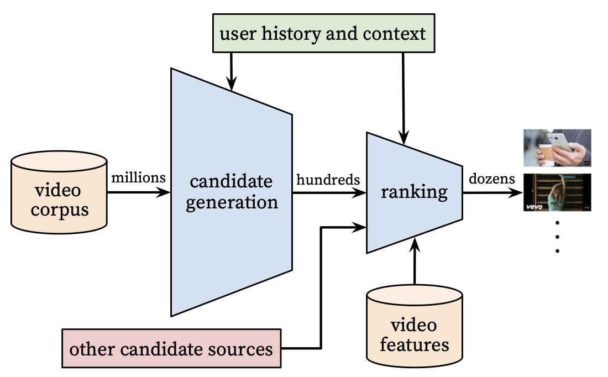

  

# Overview

The goal of this assignment is to to analyze an existing recommender system of interest.  This will include:

1. Performing a Scenario Design analysis as described below.  Considering whether it makes sense for your selected recommender system to perform scenario design twice, once for the organization (e.g. Amazon.com) and once for the organization's customers.
2. Attempt to reverse engineer what you can about the site, from the site interface and any available information that you can find on the Internet or elsewhere.
3. Include specific recommendations about how to improve the site's recommendation capabilities going forward. 
4. Create your report using an R Markdown file, and create a discussion thread with a link to the GitHub repo where your Markdown file notebook resides.  You are not expected to need to write code for this discussion assignment.

 

# [{width=200px}](https://www.youtube.com)

YouTube is an online video sharing and social media platform owned by Google. YouTube is the second most visited website in the United States. YouTube represents one of the largest scale and most sophisticated industrial recommendation systems in existence.

 

# Scenario Design  

For YouTube's recommendation system it would make sense to perform the scenario design analysis across the three primary platform stakeholders: content consumer (consumer), content creator (suppler), and the YouTube organization (platform owner).

## Scenario Design: Content Consumer

**1. Who are your target users?**

- YouTube's target user base is broad and includes everyone with internet access:
    - Over 2.3 billion people worldwide use YouTube once a month (Oct 2021).
    - Most YouTube users fall in the age group of 15-35.
    - More than 70% of YouTube watch time comes from mobile devices.
    - The male-female ratio of YouTube viewers is 11:9.

**2. What are their key goals?**

- For content consumer their goals can be broken down into:
    - Entertainment - general entertainment and access to video content
    - Education - access to educational content published by individual content creators or educational organizations
    - Information - news and information regarding world events, local events, athletics or specific fields of study

**3. How can you help them accomplish those goals?**

- There are various steps that content consumer can take to support their goals these include:
    - Help build the community - create a profile and engage with the platform's social / community tools
    - Curate and Moderate Content - YouTube has been criticized for the platforms ability to manage offensive, illegal, hateful and erroneous content. Identifying that content as a community, flagging it and holding the platform accountable are all tactics that can employed to improve the overall experience. 

## Scenario Design:  Content Creator
 
**1. Who are your target users?**

- Companies, organizations and individuals that generate content are the target users.
    - 12 million amateur creators
    - 1 million professional creators

**2. What are their key goals?**

- For content creators their goals can be broken down into:
    - Expression of creativity - YouTube is a platform that artists and performers can use to present their creativity
    - Build and audience - Given its size and feature set for creators, YouTube is an effective platform for showcasing creative talent and building an audience. 
    - Earn a living - YouTube and approved creators participate in Google's AdSense program, which generates revenue for both parties      

**3. How can you help them accomplish those goals?**

- There are various steps that content creators can take to support their goals these include:
    - Consistency - Consistent engagement and creation of content. 
    - Promote Content - Understand the YouTube's recommendation system and develop content that engages your target audience 
 
 
## Scenario Design: YouTube / Google
 
**1. Who are your target users?**

From the the YouTube corporate perspective the target users of the platform are content consumers, content providers, and advertisers. 

**2. What are their key goals?**

YouTube original intended purpose was to provide a platform that would make sharing video content easier. The companies stated mission is **“to give everyone a voice and show them the world.”**

YouTubes goals for the feed / recommendation engine were summed up by Christos Goodrow, YouTube’s director of engineering for search and discovery **“We believe that for every human being on earth, there’s 100 hours of YouTube that they would love to watch,”** 

And this goes without saying making economic profit is a key driver for any for profit venture. 

**3. How can you help them accomplish those goals?**

- Grow the platform and Increases platform usage - the value of YouTube as an platform is directly proportional to its user base. 
- Add tools and features - improving the platform to attract more content creators, make it easier for content consumers and provide more capabilities for advertisers to reach their target audience with desired messaging. 
 
 
 

# Reverse Engineering Recommender System

The YouTube recommendation system is driven by the Google Brain deep learning artificial intelligence project. Google Brain is a deep learning artificial intelligence research team, a division of Google dedicated to artificial intelligence. Formed in 2011, Google Brain combines open-ended machine learning research with information systems and large-scale computing resources. Google Brains machine learning tools have been released as the TensorFlow open source libraries.        

The Recommendations Syste for YouTube is constructed from two neural networks 1) candidate generation and 2) ranking

{width=450px}

1. candidate generation - The Candidate Generation neural net collects and collates user information including user history, user feedback, channel subscriptions, collaborative filtering and trending content to create a small subset (hundreds) of recommended videos from a large corpus. The goal is create a highly relevant list of videos for a specific users. 

2. ranking - The Ranking neural net ranks videos by assigning a relevance score to each video. This network takes a richer set of features for each video, and scoring each item from the candidate generation network.

The two-stage approach to recommendation allows YouTube to breakdown the problem into manageable steps. The first step filter the large video corpus (millions) into a manageable set of recommendations (hundreds). The smaller set can then be scored and ranked for relevance to the user.YouTube estimates that more than 70 percent of the time people spend watching videos on the site is now driven by YouTube’s algorithmic recommendations 

 

# Improving YouTube Recommender System

The best improvement that YouTube could make to their recommender system would be to provide users with more context about their feed. They should increasing the audit and curration of inaccurate harmful content and distinguishing content from trusted sources.

YouTube has become more than just a simple video sharing platform for entertainment purposes. It serves the informational and educational needs of the general populations. Like other social media platforms it occupies a unique space between entertainment and trusted source. However its diffused control structure and open policies means that most actors speak with the same authority on the platform. This in all likelihood has contributed to the platforms success but it undoubtedly has a societal cost. 

 

# References  

1) [Learn about recommendations on YouTube](https://www.youtube.com/watch?v=nYMBHwf4owY)
2) [Google Brain](https://research.google/teams/brain/)
3) [How Youtube Perfected The Feed](https://www.theverge.com/2017/8/30/16222850/youtube-google-brain-algorithm-video-recommendation-personalized-feed)
4) [Deep Neural Networks for YouTube Recommendations](https://static.googleusercontent.com/media/research.google.com/en//pubs/archive/45530.pdf)

