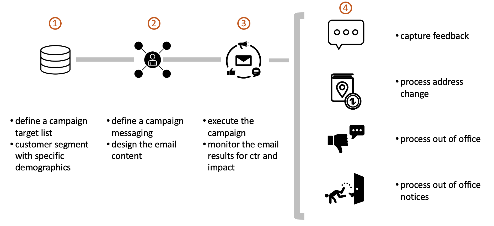

```{r setup}
knitr::opts_chunk$set(echo = TRUE)
library(tidyverse)
library(stringr)
library (readr)
library(tidytext)
library(glue)
library(textdata)
library(ggplot2)
library(topicmodels)

get_sentiments(lexicon = c("bing", "afinn", "loughran", "nrc"))

```


```{r global}

email_path = "/Users/dsimbandumwe/dev/cuny/data_607/DATA607/presentation/email/"
known_emails <- c("dsimbandumwe@gmail.com","ds@gmail.com","return@gmail.com","marketing@mm.com")

```


```{r functions}

# get email text    
GetFile <- function(file, path){
    
    fileName <- glue(path, file, sep = "")
    fileName <- trimws(fileName)
    
    # read in the new file
    fileText <- glue(read_file(fileName))
    fileText <- gsub("\\$", "", fileText) 
    return(fileText)
}


# parse email text for the too field
GetToEmail <- function(fileText) {
    s1 <- unlist(str_extract_all(fileText, "^From:\\s*[:graph:]*@[:graph:]*"))
    s1 <-  str_remove_all(s1, "From:|\\s|\\:|\\<|\\>|\\\"")
    return (s1)
}


# get the list of related emails
GetRelatedEmails <- function(fileText, fromEmail, emails) {
    
    str = unlist(regmatches(
        fileText, gregexpr(
          "([_a-z0-9-]+(\\.[_a-z0-9-]+)*@[a-z0-9-]+(\\.[a-z0-9-]+)*(\\.[a-z]{2,4}))", fileText)
        )
    )
    
    str <-  setdiff(str, emails)
    str <- setdiff(str, fromEmail)
    
    
    if (str_detect(fileText,"change")) {
      str <- tibble(str)
      str <- str %>% 
        mutate (
          event = "change address"
        )
    }
    else {
      str <- tibble(str)
      str <- str %>% 
        mutate (
          event = "other"
        )
    }

    
    return (str)
}


# get sentiments
GetSentiment <- function(fileText, fromEmail) {

    # tokenize
    tokens <- tibble(text = fileText) %>% unnest_tokens(word, text)
    
    # get the sentiment from the first text: 
    afinn <- tokens %>%
        mutate(word_count = 1:n(),
               index = word_count %/% 500 + 1) %>% 
        inner_join(get_sentiments("afinn")) %>%
        group_by(index) %>%
        summarise(sentiment = sum(value)) %>%
        mutate(method = "AFINN")
    
    
    # return our sentiment dataframe
    afinn %>% 
        mutate (
            email = fromEmail
        )
    
    return(afinn)
    
}
    


```


# Introduction
In my last position one of my responsibilities was to advocate for our digital services with our customers. One of the tools we used was email campaigns and mass mailings. My team was responsible for monitoring the responses to our advertising activity and forwarding any complaints to our compliance team to remediation. This was a manual process that took a substantial amount of my team time.





## process the file data
read all text emails and process the 

```{r}

files <- list.files(email_path )
sentiment_df <- tibble(
  email = character(),
  sentiment = double(),
  method = character()
)

email_df <- tibble(
  email = character(),
  event = character(),
  related_email = character()
)


for (i in files) {
  
  fileText <- GetFile(i,email_path)
  fromEmail <- GetToEmail(fileText)
  
  # get sentiment
  s_df <- GetSentiment(fileText, fromEmail)
  s_df <- s_df %>% 
    mutate (
      email = fromEmail
    ) %>% 
    select (email, sentiment, method)
    sentiment_df <- union(s_df, sentiment_df)
    
  

  
  # get other emails
  rel_df <- GetRelatedEmails(fileText, fromEmail, known_emails) 
  rel_df <- tibble(rel_df) %>% 
    rename (related_email = str) %>%
    mutate (
      email = fromEmail
    )
    email_df <- union(email_df, rel_df)
  
    
    
}


```


## Conclusion

After processioning the 8 emials in the folder we generated the following sentiment scores for each email.
```{r}
# sentiment analysis
sentiment_df

```


The 8 emails contained the following secondary emails. Processing the text in the email we can map the new email address to an event.
```{r}
# email output
email_df


```


