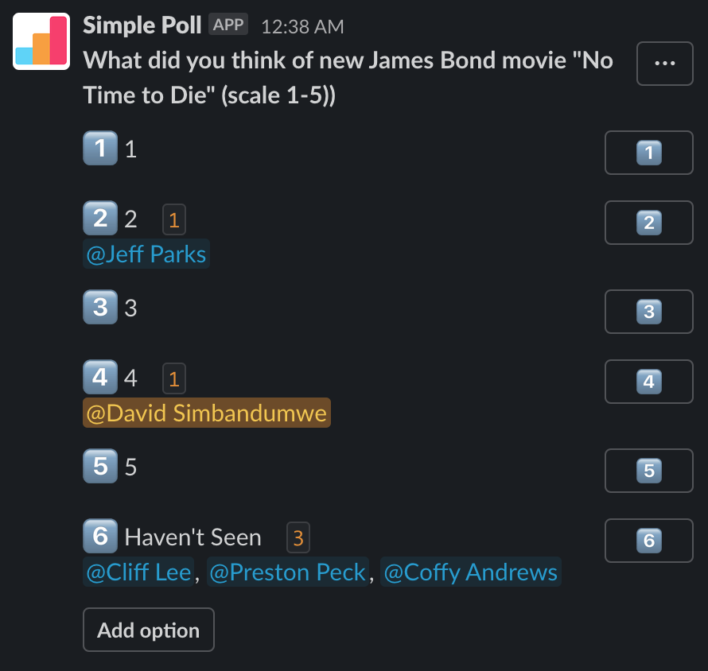
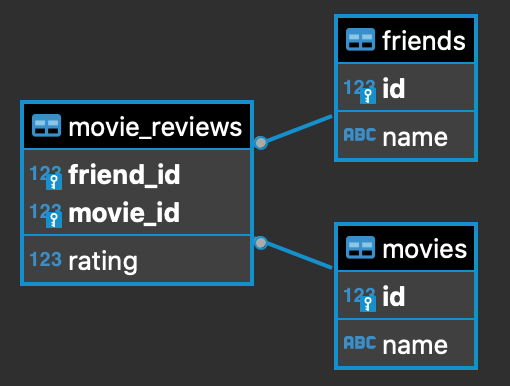

#Introduction
This exercise involves surveying classmate, and invisible friends about their movie preferences. We selected 6 current releases and conducted a open ended poll on slack and a poll of my imaginary friends. 


#Approach
Given the open-ended nature of this assignment I chose to approach it using the following methodology.


```{r load-packages, message=FALSE }
library(dplyr)
library(tidyverse)
library(openintro)
library(RMySQL)
library(ggplot2)

```


**1. Survey -** use 2 approaches to survey classmates and friends on movie ratings. The data was exists in a mysql database with the following structure



**2. Create Database -** designed the database schema and loaded the tables with meta data and survey data. included several database constraints to ensure cleaner data at the sources.


```{r read connect}
usr <- keyring::key_list("DATA606")[1,2]
pwd <-  keyring::key_get("DATA606", usr)
con = dbConnect(MySQL(), user=usr, password=pwd, dbname='DATA606', host='localhost')

```


```{r read create database tables}

# friends
query <- "DROP TABLE IF EXISTS friends CASCADE;"
results <- dbSendQuery(con, query)
#dbClearResult(results)

query<-"CREATE TABLE friends (
  id INT,
  name TEXT,
  PRIMARY KEY (id)
 );"
results <- dbSendQuery(con, query)
dbClearResult(results)


# moview
query <- "DROP TABLE IF EXISTS movies CASCADE;"
results <- dbSendQuery(con, query)
dbClearResult(results)
query<- "CREATE TABLE movies (
    id INT,
    name TEXT,
    PRIMARY KEY (id)
);"
results <- dbSendQuery(con, query)
dbClearResult(results)


# moview reviews
query <- "DROP TABLE IF EXISTS movie_reviews CASCADE;"
results <- dbSendQuery(con, query)
dbClearResult(results)
query<- "CREATE TABLE movie_reviews (
    friend_id INT,
    movie_id INT,
    rating INT,
    PRIMARY KEY (friend_id,movie_id)
);"
results <- dbSendQuery(con, query)
dbClearResult(results)


```


```{r read insert data}


#insert friends
dbGetQuery(con, "insert into friends 
                    (id,name) 
                values 
                    (1,'Bob'),
                    (2,'Sam'),
                    (3,'Frank'),
                    (4,'Ann'),
                    (5,'Sue'),
                    (6,'Candy'),
                    (7,'David'),
                    (8,'Jeff'),
                    (9,'Cliff'),
                    (10,'Preston'),
                    (11,'Coffy')
           ;")


#insert movies
dbGetQuery(con, "insert into movies 
                    (id,name) 
                values 
                    (1,	'No Time to Die'),
                    (2,	'Free Guy'),
                    (3,	'Respect'),
                    (4,	'The Suicide Squad'),
                    (5,	'Jungle Cruise'),
                    (6,	'F9: The Fast Saga')
           ;")


#insert reviews
dbGetQuery(con, "insert into movie_reviews 
                    (friend_id,movie_id,rating) 
                values 
                    (1, 1, 5),
                    (1, 2, 3),
                    (1, 3, 7),
                    (1, 4, 999),
                    (1, 5, 2),
                    (1, 6, 4),
                    (2, 1, 5),
                    (2, 2, 4),
                    (2, 3, 2),
                    (2, 4, 5),
                    (2, 5, 2),
                    (2, 6, 4),
                    (3, 1, 4),
                    (3, 2, 1),
                    (3, 3, 2),
                    (3, 4, 1),
                    (3, 5, 2),
                    (3, 6, 2),
                    (4, 1, 4),
                    (4, 2, 6),
                    (4, 3, 2),
                    (4, 4, 1),
                    (4, 5, 4),
                    (4, 6, 1),
                    (5, 1, 5),
                    (5, 2, 5),
                    (5, 3, 2),
                    (5, 4, 3),
                    (5, 5, 1),
                    (5, 6, 1),
                    (6, 1, 5),
                    (6, 2, 5),
                    (6, 3, 2),
                    (6, 4, 3),
                    (6, 5, 1),
                    (6, 6, 1),
                    (7, 1, 5),
                    (8, 1, 2),
                    (9, 1, 0),
                    (10, 1, 0),
                    (11, 1, 0)
           ;")

```


**3. Read Data -** This was a small dataset so I read the data directly into an R dataframe
```{r read data from sql}

#####
#
# load data
#
#####


rs = dbSendQuery(con, "select * 
            from movie_reviews
            Join friends 
            	on friends.id = movie_reviews.friend_id
            Join movies
            	on movies.id = movie_reviews.movie_id")

data = fetch(rs, n=-1)
dbDisconnect(con)


```


**4. Cleaned Data -** Removed all invalid rows not filtered by the database constraints. 

```{r clean data and calc meanl}


#####
#
# clean data
#
#####

clean_data <- subset(data, data$rating > 0 & data$rating < 6) 


#####
#
# calculate average
#
#####
avg <- aggregate(clean_data$rating, list(clean_data$movie_id), FUN=mean) 
names(avg)[1] <- "movie_id"
names(avg)[2] <- "avg_rating"
avg


#####
#
# build final dataframe
#
#####
clean_data <- subset(clean_data, , select=c(movie_id, name.1))

clean_data <- unique(clean_data)
clean_data

avg <- merge(avg,clean_data,by="movie_id")
names(avg)[3] <- "movie_name"
avg


```


**5. Graph Results -** Graph the average results from the survey 

```{r graph}

ggplot(data=avg, aes(x=movie_name, y=avg_rating)) + geom_bar(stat="identity") + coord_flip()

```


#Conclusion
In this very unscientific survey "No Time to Loose" received the highest ratings. We did not see equal numbers of responses for each record.


